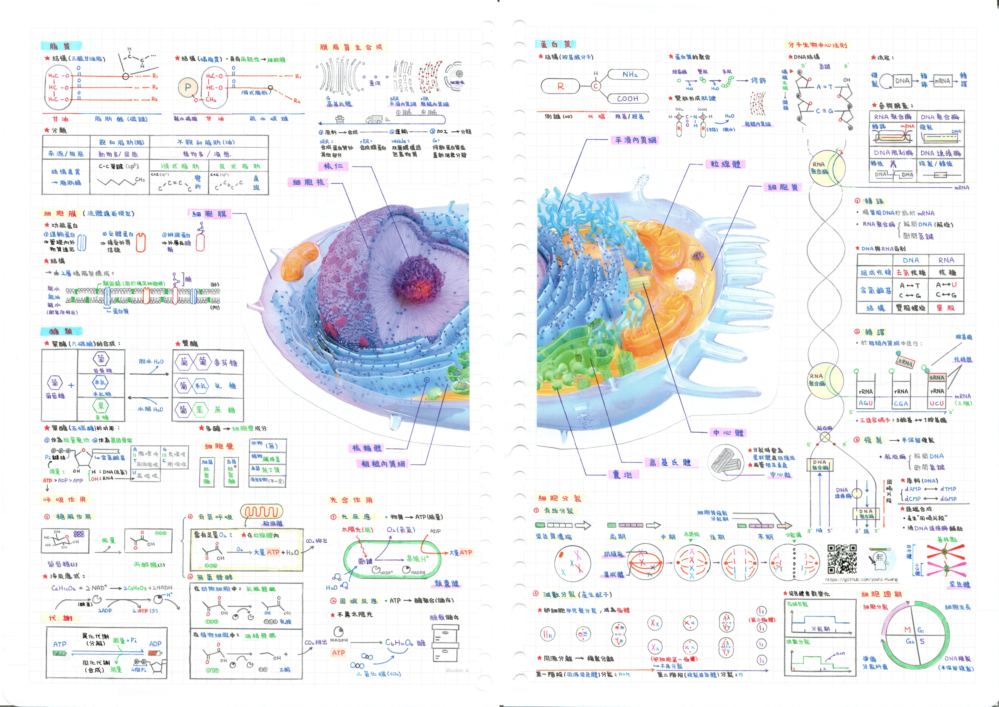

# 手寫筆記電子化

[](https://github.com/yoshi-huang)
[](https://www.threads.com/@yoshi.wm_)
[](https://discord.com/channels/@me/874233210190573578)

## 一、緣起

在學習的過程中，我很早就發現一件事情：

我對 **需要大量背誦的科目**並不擅長，但對 **數理邏輯與結構化內容**則相對容易理解。

因此從國中開始，我在準備考試時會採用一個固定的方法：

**把整個章節整理成一份 A4 筆記。**

整理筆記的過程其實不只是抄寫，而是一種重新理解內容的方式：

- 把零散的知識整理成結構
- 找出不同概念之間的關係
- 用自己的方式重新表達課本內容

久而久之，這變成我主要的學習方式之一。

---

## 二、目的

在準備高中學測的過程中，我仍然維持這個習慣。


[`⭢ 完整筆記在此`](pdfs/Natural_Science/bio/2025_Cell_GSAT.pdf) 

每個科目我都會整理成 **A4 手寫筆記**，並在考前用這些筆記進行複習。

在學測準備期間，我曾經把部分筆記掃描後上傳到 GitHub，  
作為一個 **數位備份與整理的開始**。

考試結束之後，有了一些比較充裕的時間，因此我開始進一步思考：

> 這些筆記如果只留在紙本，可能會隨時間散失；  
> 但如果整理成數位檔案，就可以長期保存與回顧。

於是我重新把從 **國中到高中仍然找得到的筆記**整理並電子化。

在整理的過程中，我不只是單純掃描文件，而是重新檢視自己過去的學習方式：

- 不同科目的整理方式其實不太一樣
- 有些筆記更偏向公式與推導
- 有些則是概念之間的關聯整理

因此我將筆記依照 **科目與主題**重新分類，並建立一個簡單的資料結構，讓它們能夠被長期保存與查閱。

---

## 三、筆記結構

目前所有筆記都已整理為 **PDF 格式**，並依科目分類存放。

### 目錄結構

```
├── English Grammar/    # 英文文法筆記
├── Math/               # 數學筆記
└── Natural Science/
    ├── bio/            # 生物筆記
    ├── chm/            # 化學筆記
    └── others/         # 其他筆記
└── Social Science/
    ├── geo/            # 地理筆記
    ├── his/            # 歷史筆記
    └── civ/            # 公民筆記
``` 


這些筆記主要是依照當時的學習需求整理，因此每份筆記的內容與密度也有所不同。

---

## 四、筆記方式

### 手寫整理

- 使用 **A4 紙手寫**
- 黑筆書寫主要內容
- 彩色筆標註重點與分類

這種方式可以在整理時同時思考內容結構。

### 掃描與數位化

- **A4 以下**：使用手機掃描 App（Adobe Scan）
- **A4 以上**：使用影印機掃描

所有文件最終轉換為 **PDF 檔案** 保存。

---

## 五、為什麼要公開這些筆記

這些筆記最初只是為了自己的學習整理。

但在電子化之後，我發現它其實也記錄了一段完整的學習過程：

- 從國中到高中
- 不同科目的理解方式
- 自己逐漸形成的整理習慣

因此我選擇把這些筆記放在 GitHub 上，作為一個 **公開的學習紀錄**。

它不一定是最完整或最標準的整理，但反映了我在學習過程中的思考方式。

---

## 六、回顧

回頭看這些筆記時，我發現一件有趣的事情：

最初只是為了應付考試而整理的內容，  
最後卻變成了一個可以長期保存的 **個人知識資料庫**。

而整理筆記這件事，本身也讓我逐漸建立了一種習慣：

**把學到的東西轉換成自己可以理解的結構。**

這大概也是我最重要的收穫。

而我也逐漸意識到，這種整理方式其實和我擅長的事情有關。

相較於單純記憶大量內容，我更習慣用「結構」去理解知識。例如：

- 把一個章節拆成幾個核心概念
- 找出概念之間的關係
- 用圖表或條列的方式重新組織內容

手寫筆記其實就是這個過程的具體呈現。  
在整理筆記時，我不只是把內容寫下來，而是重新思考：

- 哪些內容是核心概念
- 哪些是推導或延伸
- 哪些可以合併成同一個架構

這和我平常寫程式時的習慣其實很相似。

在程式設計中，也需要：

- 把問題拆成結構
- 建立清楚的分類
- 讓資訊能夠被快速找到與使用

因此當我開始把筆記電子化時，很自然地選擇用 **GitHub** 來整理與保存這些資料。  
GitHub 的資料夾結構、版本管理與公開分享機制，剛好提供了一種管理知識的方式。

某種程度上，這個筆記整理專案其實和我其他的程式專案有相同的核心：

> **把原本零散的資訊整理成一個清楚的結構。**

只是這一次整理的對象不是程式，而是自己過去的學習內容。

這個過程也讓我更加確定一件事：  
我很喜歡把知識轉換成「可以被組織與理解的結構」，而這也成為我持續學習的一種方式。 

## 七、備註

本筆記僅作為**個人學習紀錄**與**公開展示**用途，  
若需引用、轉載、或分享，請**附上原作者出處**。

---

> © 2026 by yoshi-huang  
> Personal handwritten notes for academic review and archival purposes.
